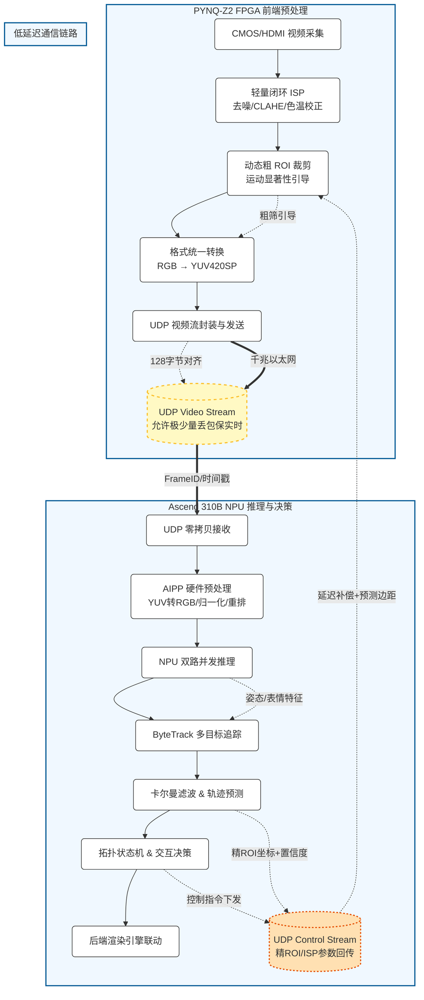

# 华强X昇腾赛题

## 310B

## pynq

## 通信

通信采取UDP的方式进行传输，其目的是低延迟

```mermaid
flowchart TD
    %% 样式定义
    classDef hardware fill:#f0f8ff,stroke:#005b96,stroke-width:2px;
    classDef module fill:#ffffff,stroke:#333,stroke-width:1px,rx:5px,ry:5px;
    classDef network fill:#fff9c4,stroke:#fbc02d,stroke-width:2px,stroke-dasharray: 5 5;
    classDef control fill:#ffe0b2,stroke:#e65100,stroke-width:2px,stroke-dasharray: 3 3;

    %% 硬件节点
    subgraph PYNQ_Z2 [PYNQ-Z2 FPGA 前端预处理]
        direction TB
        Cam[CMOS/HDMI 视频采集] --> ISP[轻量闭环 ISP<br>去噪/CLAHE/色温校正]
        ISP --> CoarseROI[动态粗 ROI 裁剪<br>运动显著性引导]
        CoarseROI --> Format[格式统一转换<br>RGB → YUV420SP]
        Format --> UDPSend[UDP 视频流封装与发送]
        
        CoarseROI -.-> |粗筛引导| Format
        UDPSend -.-> |128字节对齐| NetLink
    end

    subgraph Ascend_310B [Ascend 310B NPU 推理与决策]
        direction TB
        UDPRecv[UDP 零拷贝接收] --> AIPP[AIPP 硬件预处理<br>YUV转RGB/归一化/重排]
        AIPP --> NPU[NPU 双路并发推理]
        NPU --> MOT[ByteTrack 多目标追踪]
        MOT --> Kalman[卡尔曼滤波 & 轨迹预测]
        Kalman --> Decision[拓扑状态机 & 交互决策]
        Decision --> Backend[后端渲染引擎联动]
        
        NPU -.-> |姿态/表情特征| MOT
        Kalman -.-> |精ROI坐标+置信度| CtrlStream
    end

    %% 通信链路
    subgraph Network [低延迟通信链路]
        direction LR
        NetLink[(UDP Video Stream<br>允许极少量丢包保实时)]
        CtrlStream[(UDP Control Stream<br>精ROI/ISP参数回传)]
    end

    %% 核心数据交互连线
    UDPSend ==> |千兆以太网| NetLink
    NetLink ==> |FrameID/时间戳| UDPRecv
    Decision -.-> |控制指令下发| CtrlStream
    CtrlStream -.-> |延迟补偿+预测边距| CoarseROI

    %% 应用样式
    class PYNQ_Z2,Ascend_310B,Network hardware;
    class Cam,ISP,CoarseROI,Format,UDPSend,UDPRecv,AIPP,NPU,MOT,Kalman,Decision,Backend module;
    class NetLink network;
    class CtrlStream control;
```
